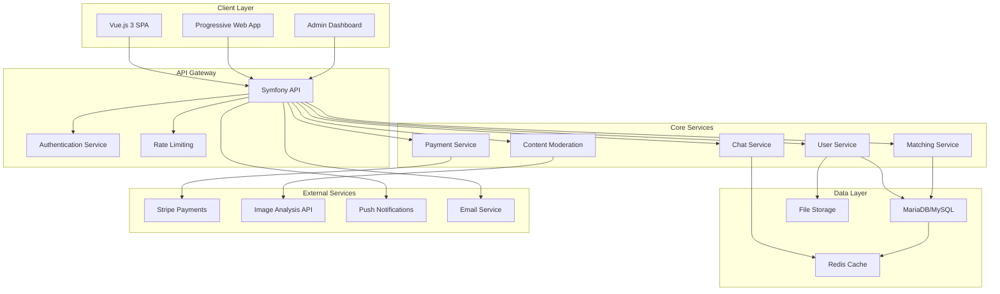

# Design Document - Adult Dating Platform

## Overview

This document outlines the technical design for a privacy-focused adult dating platform built with modern web technologies. The platform emphasizes user safety, scalable architecture, and engaging user experience while supporting diverse relationship types and monetization through a token-based system.

### Core Architecture Principles

- **API-First Design**: RESTful API backend with clear separation of concerns
- **Mobile-First Responsive**: Single codebase supporting all device types
- **Privacy by Design**: User data protection and safety features built-in
- **Scalable Infrastructure**: Designed to grow from O2Switch hosting to AWS cloud
- **Real-time Communication**: WebSocket integration for instant messaging and notifications
- **Modular Monetization**: Granular control over premium features via admin dashboard

## Architecture

### High-Level System Architecture



### Technology Stack

**Backend Framework**: Symfony 6.x
- **API Platform**: For RESTful API generation and documentation
- **Doctrine ORM**: Database abstraction and entity management
- **JWT Authentication**: Secure token-based authentication
- **Symfony Messenger**: Asynchronous message handling for heavy operations
- **Symfony Security**: Role-based access control with granular permissions
- **Custom Roles**: ROLE_USER, ROLE_ID_VERIFIED, ROLE_HAS_TOKENS, ROLE_EARLY_ADOPTER, ROLE_ADMIN

**Frontend Framework**: Vue.js 3
- **Composition API**: Modern reactive programming model
- **Pinia**: Centralized state management
- **Vue Router**: Client-side routing for SPA
- **Vite**: Fast build tool and development server
- **PWA (Progressive Web App)**: Native app-like experience on mobile devices with offline capabilities, push notifications, and home screen installation

**Database**: MariaDB/MySQL 8.0+
- **Spatial Extensions**: For geolocation queries and distance calculations
- **Full-Text Search**: For user search and filtering
- **Proper Indexing**: Optimized for matching algorithms and real-time queries

**Caching & Session**: Redis
- **Session Storage**: User sessions and authentication tokens
- **Match Caching**: Temporary storage for matching algorithms
- **Real-time Data**: WebSocket connection management

## Components and Interfaces

### Backend API Structure

#### Core Entities

**User Entity**
```php
class User implements UserInterface
{
    private int $id;
    private string $email;
    private string $passwordHash;
    private UserProfile $profile;
    private UserPreferences $preferences;
    private Point $location; // Spatial data type
    private Collection $roles; // Symfony roles: ROLE_USER, ROLE_ID_VERIFIED, ROLE_HAS_TOKENS, ROLE_EARLY_ADOPTER, etc.
    private int $tokenBalance;
    private DateTime $createdAt;
    private DateTime $lastActiveAt;
    private bool $isActive;
    private Collection $blockedUsers;
    private Collection $privatePhotoAccess; // Users who can access private photos
}
```

**UserProfile Entity**
```php
class UserProfile
{
    private int $userId;
    private User $user;
    private string $displayName;
    private int $age;
    private string $description;
    private string $sexuality;
    private string $maritalStatus;
    private array $hobbies;
    private string $lookingFor;
    private Collection $photos; // ManyToMany relationship with Photo entity
    private string $preferredLanguage;
}

/**
 * Photo Entity - Separate entity for better relationship management
 */
class Photo
{
    private int $id;
    private string $filename;
    private string $originalName;
    private bool $isPrivate;
    private bool $isPrimary;
    private int $uploadOrder;
    private string $moderationStatus; // PENDING, APPROVED, REJECTED
    private Collection $profiles; // ManyToMany - photos can be shared across profiles if needed
    private Collection $authorizedUsers; // Users who can access this private photo
    private DateTime $createdAt;
}

/**
 * Private Photo Access Entity - Junction table for private photo permissions
 */
class PrivatePhotoAccess
{
    private int $id;
    private Photo $photo;
    private User $authorizedUser;
    private User $photoOwner;
    private DateTime $grantedAt;
    private DateTime $expiresAt;
    private bool $isActive;
}
```

**Match Entity**
```php
class Match
{
    private int $id;
    private int $user1Id;
    private int $user2Id;
    private MatchStatus $status; // PENDING, MUTUAL, EXPIRED
    private DateTime $createdAt;
    private DateTime $expiresAt;
    private bool $isSuperLike;
}
```

#### API Endpoints Structure

**Authentication Endpoints**
- `POST /api/auth/register` - User registration with email validation
- `POST /api/auth/login` - User authentication
- `POST /api/auth/refresh` - JWT token refresh
- `POST /api/auth/verify-email` - Email verification
- `POST /api/auth/forgot-password` - Password reset

**User Management Endpoints**
- `GET /api/users/profile` - Get current user profile
- `PUT /api/users/profile` - Update user profile
- `POST /api/users/photos` - Upload photos
- `DELETE /api/users/photos/{id}` - Delete photo
- `POST /api/users/verify-id` - Submit ID verification
- `GET /api/users/blocked` - Get blocked users list
- `POST /api/users/block/{userId}` - Block user
- `DELETE /api/users/block/{userId}` - Unblock user

**Matching Endpoints**
- `GET /api/matches/discover` - Get potential matches
- `POST /api/matches/swipe` - Record swipe action
- `GET /api/matches/mutual` - Get mutual matches
- `POST /api/matches/super-like/{userId}` - Send super like

**Messaging Endpoints**
- `GET /api/messages/conversations` - Get conversation list
- `GET /api/messages/conversation/{userId}` - Get conversation messages
- `POST /api/messages/send` - Send message
- `PUT /api/messages/{id}/read` - Mark message as read

**Token & Payment Endpoints**
- `GET /api/tokens/balance` - Get token balance
- `GET /api/tokens/packages` - Get available token packages
- `POST /api/tokens/purchase` - Purchase tokens via Stripe
- `POST /api/tokens/spend` - Spend tokens on features

### Frontend Component Architecture

#### Vue.js Component Structure

**Core Layout Components**
- `AppLayout.vue` - Main application layout with navigation
- `MobileNavigation.vue` - Mobile-specific navigation
- `HeaderBar.vue` - Top navigation with notifications
- `SidebarMenu.vue` - Desktop sidebar navigation

**Authentication Components**
- `LoginForm.vue` - User login interface
- `RegisterForm.vue` - Registration with email validation
- `EmailVerification.vue` - Email verification flow
- `PasswordReset.vue` - Password reset functionality

**Profile Management Components**
- `ProfileEditor.vue` - Comprehensive profile editing
- `PhotoUploader.vue` - Photo upload with preview
- `PreferencesSettings.vue` - User preferences configuration
- `PrivacySettings.vue` - Privacy and safety settings

**Matching & Discovery Components**
- `SwipeInterface.vue` - Card-based swiping interface
- `MatchCard.vue` - Individual user card display
- `MatchesList.vue` - List of mutual matches
- `SearchFilters.vue` - Advanced search and filtering

**Messaging Components**
- `ConversationList.vue` - List of active conversations
- `ChatInterface.vue` - Real-time chat interface
- `MessageComposer.vue` - Message input with features
- `InternalMailbox.vue` - Email-style messaging system

#### State Management with Pinia

**Security Best Practices for Frontend State:**

1. **Token Balance Security**: The frontend `tokenBalance` is stored for UI display purposes only. The backend maintains the authoritative balance and validates all token operations.

2. **Never Trust Frontend Data**: All sensitive operations (token spending, role checks, permissions) are validated on the backend regardless of frontend state.

3. **Balance Synchronization**: The frontend balance is updated only when the backend returns the new balance after successful operations.

4. **Role-Based UI**: Frontend roles are used for UI convenience (showing/hiding features) but backend always enforces actual permissions.

**User Store**
```javascript
export const useUserStore = defineStore('user', () => {
  const currentUser = ref(null)
  const isAuthenticated = ref(false)
  const userRoles = ref([])
  
  // Token balance stored for UI display purposes only
  // SECURITY NOTE: This value is READ-ONLY for frontend display
  // Never send this value to backend - backend maintains authoritative balance
  const tokenBalance = ref(0)
  
  const login = async (credentials) => { 
    const response = await api.post('/api/auth/login', credentials)
    currentUser.value = response.data.user
    userRoles.value = response.data.user.roles
    tokenBalance.value = response.data.user.tokenBalance // Initial balance from backend
    isAuthenticated.value = true
  }
  
  const logout = () => {
    currentUser.value = null
    userRoles.value = []
    tokenBalance.value = 0
    isAuthenticated.value = false
  }
  
  const updateProfile = async (profileData) => { /* ... */ }
  
  // Helper methods to check roles (but always verify on backend)
  const hasRole = (role) => userRoles.value.includes(role)
  const isIdVerified = computed(() => hasRole('ROLE_ID_VERIFIED'))
  const hasTokens = computed(() => hasRole('ROLE_HAS_TOKENS'))
  const isEarlyAdopter = computed(() => hasRole('ROLE_EARLY_ADOPTER'))
  
  // Refresh token balance from backend (called after purchases/spending)
  const refreshTokenBalance = async () => {
    const response = await api.get('/api/tokens/balance')
    tokenBalance.value = response.data.balance
    return response.data.balance
  }
  
  // Spend tokens - backend validates and returns new balance
  const spendTokens = async (feature, cost) => {
    const response = await api.post('/api/tokens/spend', { feature, cost })
    // Backend returns updated balance after successful spending
    tokenBalance.value = response.data.newBalance
    return response.data
  }
  
  // Purchase tokens - backend processes payment and returns new balance
  const purchaseTokens = async (packageId) => {
    const response = await api.post('/api/tokens/purchase', { packageId })
    // Backend returns updated balance after successful purchase
    tokenBalance.value = response.data.newBalance
    return response.data
  }
  
  return {
    currentUser,
    isAuthenticated,
    userRoles,
    tokenBalance, // READ-ONLY for UI display
    login,
    logout,
    updateProfile,
    hasRole,
    isIdVerified,
    hasTokens,
    isEarlyAdopter,
    refreshTokenBalance,
    spendTokens,
    purchaseTokens
  }
})
```

**Matching Store**
```javascript
export const useMatchingStore = defineStore('matching', () => {
  const potentialMatches = ref([])
  const mutualMatches = ref([])
  const currentMatchIndex = ref(0)
  
  const loadPotentialMatches = async () => { /* ... */ }
  const recordSwipe = async (userId, direction) => { /* ... */ }
  const sendSuperLike = async (userId) => { /* ... */ }
  
  return {
    potentialMatches,
    mutualMatches,
    currentMatchIndex,
    loadPotentialMatches,
    recordSwipe,
    sendSuperLike
  }
})
```

## Data Models

### Database Schema Management

**Doctrine ORM Integration**
The database schema will be managed entirely through Doctrine ORM with the following approach:

- **Entity Annotations/Attributes**: All table structures defined in PHP entity classes
- **Doctrine Migrations**: Automatic schema generation and version control
- **Spatial Data Support**: Doctrine extensions for MySQL spatial data types
- **Index Optimization**: Strategic indexing for geolocation queries and user matching
- **Relationship Management**: Proper foreign key constraints and cascade operations

**Key Doctrine Configurations:**
```php
// doctrine.yaml
doctrine:
    dbal:
        driver: 'pdo_mysql'
        server_version: '8.0'
        charset: utf8mb4
        default_table_options:
            charset: utf8mb4
            collate: utf8mb4_unicode_ci
    orm:
        auto_generate_proxy_classes: true
        naming_strategy: doctrine.orm.naming_strategy.underscore_number_aware
        auto_mapping: true
        mappings:
            App:
                is_bundle: false
                type: attribute
                dir: '%kernel.project_dir%/src/Entity'
                prefix: 'App\Entity'
```

**Spatial Data Configuration:**
```php
// config/packages/doctrine.yaml
doctrine:
    dbal:
        types:
            geometry: CrEOF\Spatial\DBAL\Types\GeometryType
            point: CrEOF\Spatial\DBAL\Types\Geometry\PointType
```

### Geolocation Data Handling

**Distance Calculation Query**
```sql
SELECT u.id, up.display_name, 
       ST_Distance_Sphere(u.location, POINT(?, ?)) / 1000 AS distance_km
FROM users u
JOIN user_profiles up ON u.id = up.user_id
WHERE u.is_active = TRUE
  AND ST_Distance_Sphere(u.location, POINT(?, ?)) <= ? * 1000
  AND u.id NOT IN (SELECT blocked_user_id FROM user_blocks WHERE user_id = ?)
ORDER BY distance_km ASC
LIMIT 50;
```

## Error Handling

### API Error Response Format

```json
{
  "error": {
    "code": "VALIDATION_ERROR",
    "message": "The provided data is invalid",
    "details": {
      "email": ["Email is already taken"],
      "age": ["Age must be at least 18"]
    },
    "timestamp": "2025-01-18T10:30:00Z"
  }
}
```

### Error Categories

**Authentication Errors (401)**
- `INVALID_CREDENTIALS` - Wrong email/password
- `TOKEN_EXPIRED` - JWT token has expired
- `EMAIL_NOT_VERIFIED` - Account not verified
- `ACCOUNT_SUSPENDED` - Account temporarily disabled

**Authorization Errors (403)**
- `INSUFFICIENT_TOKENS` - Not enough tokens for premium feature
- `TIER_REQUIRED` - Feature requires higher user tier
- `BLOCKED_USER` - Attempting to interact with blocked user
- `FEATURE_DISABLED` - Admin has disabled this feature

**Validation Errors (422)**
- `INVALID_AGE` - User must be 18 or older
- `INVALID_LOCATION` - Geolocation data is malformed
- `PHOTO_TOO_LARGE` - Image exceeds size limits
- `INAPPROPRIATE_CONTENT` - Content violates community guidelines

**Rate Limiting Errors (429)**
- `TOO_MANY_SWIPES` - Exceeded daily swipe limit
- `TOO_MANY_MESSAGES` - Exceeded messaging rate limit
- `TOO_MANY_REQUESTS` - General rate limiting

### Frontend Error Handling Strategy

```javascript
// Global error handler in main.js
app.config.errorHandler = (error, instance, info) => {
  console.error('Global error:', error)
  
  if (error.response?.status === 401) {
    // Redirect to login
    router.push('/login')
  } else if (error.response?.status === 403) {
    // Show upgrade prompt
    showUpgradeModal()
  } else {
    // Show generic error message
    showErrorNotification(error.message)
  }
}
```

## Testing Strategy

### Backend Testing Approach

**Unit Tests**
- Entity validation and business logic
- Service layer functionality
- Utility functions and helpers
- Matching algorithm accuracy

**Integration Tests**
- API endpoint functionality
- Database operations and queries
- External service integrations (Stripe, image analysis)
- WebSocket connection handling

**Performance Tests**
- Geolocation query performance
- Matching algorithm efficiency
- Real-time messaging load testing
- Database query optimization validation

### Frontend Testing Approach

**Component Tests**
- Vue component rendering and behavior
- User interaction handling
- State management operations
- Form validation and submission

**E2E Tests**
- Complete user registration flow
- Matching and swiping functionality
- Real-time chat operations
- Payment and token purchase flow

**Accessibility Tests**
- WCAG 2.1 compliance validation
- Keyboard navigation testing
- Screen reader compatibility
- Color contrast verification

### Testing Tools and Framework

**Backend Testing Stack**
- PHPUnit for unit and integration tests
- Symfony WebTestCase for API testing
- Doctrine Fixtures for test data
- Faker for realistic test data generation

**Frontend Testing Stack**
- Vitest for unit testing
- Vue Test Utils for component testing
- Cypress for E2E testing
- Axe-core for accessibility testing

### Continuous Integration Pipeline

```yaml
# .github/workflows/ci.yml
name: CI Pipeline
on: [push, pull_request]

jobs:
  backend-tests:
    runs-on: ubuntu-latest
    steps:
      - uses: actions/checkout@v3
      - name: Setup PHP
        uses: shivammathur/setup-php@v2
        with:
          php-version: '8.1'
      - name: Install dependencies
        run: composer install
      - name: Run PHPUnit tests
        run: ./vendor/bin/phpunit
      - name: Run static analysis
        run: ./vendor/bin/phpstan analyse

  frontend-tests:
    runs-on: ubuntu-latest
    steps:
      - uses: actions/checkout@v3
      - name: Setup Node.js
        uses: actions/setup-node@v3
        with:
          node-version: '18'
      - name: Install dependencies
        run: npm ci
      - name: Run unit tests
        run: npm run test:unit
      - name: Run E2E tests
        run: npm run test:e2e
      - name: Build production
        run: npm run build
```

This comprehensive design document provides the technical foundation for building a scalable, secure, and user-friendly adult dating platform that meets all the specified requirements while maintaining modern development practices and architectural principles.